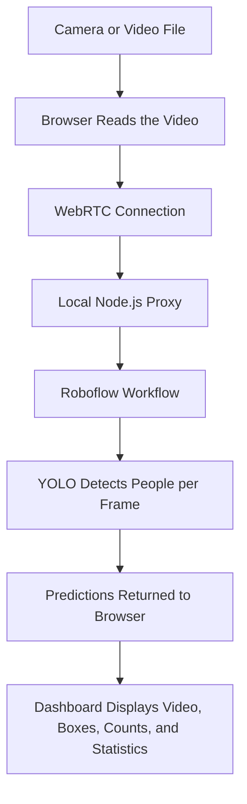

# People Counter SCSG

A browser-based people-counting dashboard powered by a Roboflow Workflow and a YOLO object-detection model. The application accepts a live camera feed or an uploaded video, sends it to Roboflow over WebRTC, and displays the detection results in real time.

## Features

- Live detection from a connected camera
- Processing of MP4, MOV, and WebM video files
- Real-time person count and bounding-box overlay
- Detection labels and confidence scores
- Peak count, average count, measured FPS, and session duration
- Detection timeline and count chart
- PNG snapshots with detection overlays
- CSV export at 0.1-second intervals
- Configurable Roboflow GPU plan, region, and processing timeout
- Server-side API key protection

## How It Works



1. The user selects a live camera or imports a video file.
2. The browser establishes a WebRTC connection through the local Node.js server.
3. The local server securely authenticates the request with Roboflow, keeping the API key out of the browser.
4. The Roboflow Workflow processes the video frame by frame using a YOLO model.
5. Each detection contains a class, confidence score, and bounding-box coordinates.
6. The browser counts the returned predictions, draws the boxes, and updates the dashboard.

## Architecture

### Browser

The frontend is implemented in `public/index.html`. It handles media selection, WebRTC streaming, result processing, bounding-box rendering, statistics, the timeline, snapshots, and CSV export.

### Local server

`server.mjs` serves the web application and exposes two proxy endpoints:

- `POST /api/init-webrtc` initializes a Roboflow WebRTC worker.
- `GET /api/turn-config` retrieves the ICE/TURN configuration required by WebRTC.

The Roboflow API key, workspace name, and workflow ID remain on the server.

### Roboflow and YOLO

The configured Roboflow Workflow receives the video and runs object detection. A typical person prediction contains:

```json
{
  "class": "person",
  "confidence": 0.94,
  "x": 420,
  "y": 250,
  "width": 110,
  "height": 280
}
```

The frontend expects the workflow to expose a data output named `predictions`. For correct people counts, this output should contain only detections for the person class.

## Requirements

- Node.js 20.6 or newer
- A Roboflow account and API key
- A Roboflow Workflow configured for person detection
- A modern browser with WebRTC support
- Camera permission when using live detection

## Installation

1. Clone the repository and enter the project directory:

   ```bash
   git clone <repository-url>
   cd PeopleCounterSCSG
   ```

2. Install the dependencies:

   ```bash
   npm install
   ```

3. Copy `.env.example` to `.env`:

   **Windows PowerShell**

   ```powershell
   Copy-Item .env.example .env
   ```

   **macOS or Linux**

   ```bash
   cp .env.example .env
   ```

4. Add your Roboflow configuration to `.env`:

   ```env
   ROBOFLOW_API_KEY=your_roboflow_api_key
   ROBOFLOW_WORKSPACE=first-project-keylu
   ROBOFLOW_WORKFLOW=people_counting-t5rly
   PORT=3001
   ```

5. Start the application:

   ```bash
   npm start
   ```

6. Open [http://localhost:3001](http://localhost:3001) in your browser.

## Usage

1. Select a camera or import a supported video file.
2. Choose the desired GPU plan, region, and timeout in the settings panel if needed.
3. Press **Start** and grant camera permission when prompted.
4. View the current count, bounding boxes, confidence scores, statistics, and timeline.
5. Use **Snapshot** to save the current frame or **Export CSV** to download the session data.

## Counting Method

The current implementation measures **frame-level occupancy**. The displayed count is the number of predictions returned for the latest frame:

```javascript
const preds = output.predictions ?? [];
const peopleCount = preds.length;
```

This is not a unique visitor counter. The application does not currently assign persistent IDs or count people crossing an entry/exit line. Unique entry and exit counting would require an object tracker such as ByteTrack or DeepSORT plus line-crossing logic.

For the timeline, the application stores the highest count observed in each 0.1-second interval. The exported CSV uses the following format:

```csv
detik,jumlah_orang
0.0,2
0.1,3
0.2,3
```

## Project Structure

```text
PeopleCounterSCSG/
|-- public/
|   `-- index.html      # Dashboard, WebRTC client, and visualization logic
|-- .env.example        # Example environment configuration
|-- .gitignore
|-- package.json
|-- package-lock.json
|-- server.mjs          # Static server and Roboflow WebRTC proxy
`-- README.md
```

## Troubleshooting

- **The server exits immediately:** Make sure `ROBOFLOW_API_KEY` is present in `.env`.
- **The camera is unavailable:** Open the application through `localhost` or HTTPS and allow camera access in the browser.
- **WebRTC cannot connect:** Check the network, firewall, selected region, and Roboflow service availability.
- **No predictions appear:** Confirm that the workspace and workflow IDs are correct and that the workflow exposes an output named `predictions`.
- **The count includes other objects:** Configure the Roboflow Workflow to filter its output to the person class.

## Security Notes

- Never place the Roboflow API key in `public/index.html` or other client-side files.
- Keep `.env` private and out of version control.
- The proxy is locked to the workspace and workflow configured on the server, preventing the browser endpoint from selecting arbitrary workflows.
